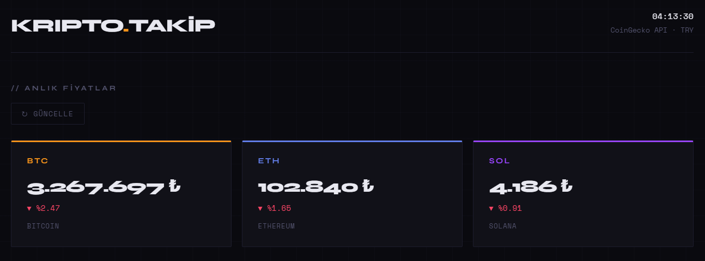
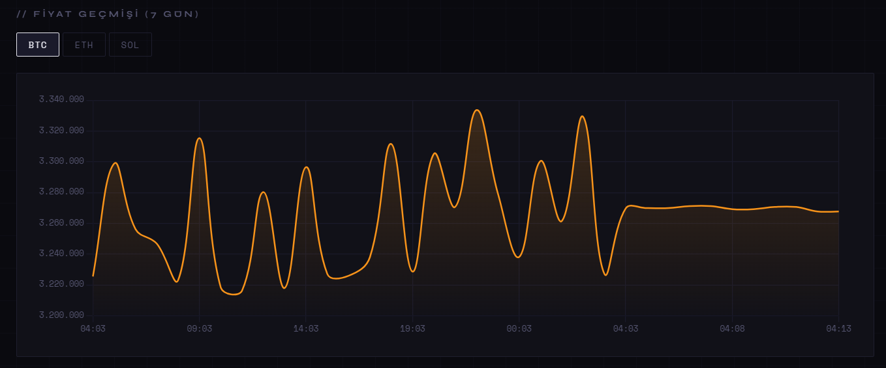
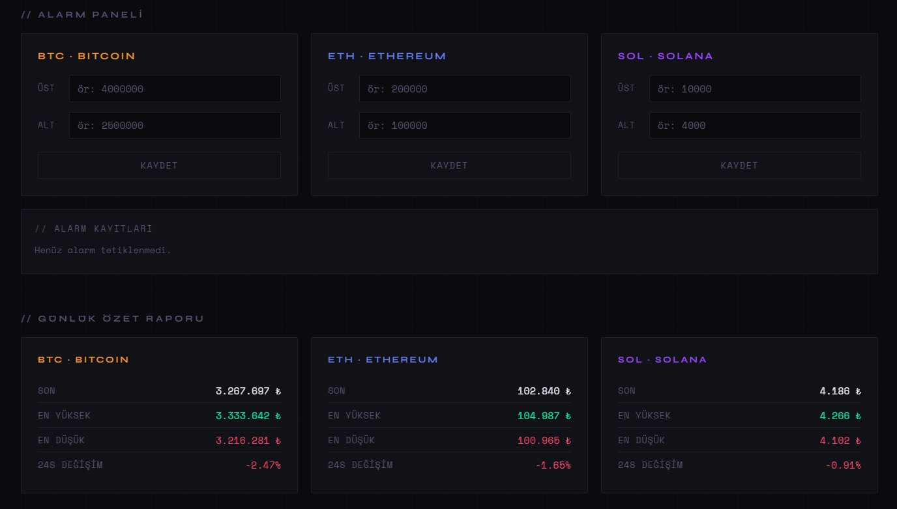

# Kripto Takip Sistemi 
 
Anlık kripto para fiyatlarını takip eden, alarm kurabilen ve günlük rapor oluşturan Python + HTML projesi.

**Canlı Demo → [beyzaturku.github.io/Kripto_Takip_Sistemi](https://beyzaturku.github.io/API_Projects/app/index.html)**

## Özellikler 
- **Anlık fiyat takibi** — BTC, ETH, SOL için canlı TRY fiyatları
- **Fiyat alarmı** — Belirlediğin eşik aşılınca terminal uyarısı
- **Günlük rapor** — Min / Max / Ortalama özeti, `.txt` olarak kaydedilir
- **Grafik** — Fiyat geçmişi çizgi grafiği ve karşılaştırma çubuk grafiği

---

## Kullanılan Teknolojiler 
| Katman | Teknoloji |
|---|---|
| Veri kaynağı | [CoinGecko Public API](https://www.coingecko.com/en/api) |
| Backend | Python 3 |
| Grafikler | Matplotlib |
| Frontend | HTML / CSS / JavaScript |
| Grafik kütüphanesi | Chart.js |
| Yayınlama | GitHub Pages |

---
## Kurulum
 
### Gereksinimler
 
- Python 3.8+
- pip
 
### Adımlar
 
```bash
# Repoyu klonla
git clone https://github.com/beyzaturku/Kript_Takip_Sistemi.git
cd API_Projects
 
# Kütüphaneleri kur
pip install requests matplotlib
```
 
---
## Kullanım
 
```bash
# Tek seferlik fiyat çek + alarm kontrol
python main.py
 
# Her 60 saniyede bir otomatik izleme
python main.py --izle 60
 
# Sadece rapor ve grafik üret
python main.py --rapor
```
 
---
## Dosya Yapısı
 
```
📁 API_Projects/
  ├── fetcher.py     ← CoinGecko'dan fiyat çeker, fiyatlar.csv'ye kaydeder
  ├── alarm.py       ← Eşik kontrolü, terminal uyarısı
  ├── report.py      ← CSV'den günlük özet raporu üretir
  ├── chart.py       ← Matplotlib ile grafik oluşturur
  ├── main.py        ← Tüm modülleri yönetir, izleme modu
  └── index.html     ← Web dashboard (GitHub Pages)
```
 
---

## Alarm Eşiklerini Ayarlama
 
`alarm.py` dosyasındaki `ESIKLER` sözlüğünü düzenle:
 
```python
ESIKLER = {
    "bitcoin":  {"ust": 4_000_000, "alt": 2_500_000},
    "ethereum": {"ust":   200_000, "alt":   100_000},
    "solana":   {"ust":    10_000, "alt":     4_000},
}
```
 
`ust` → bu fiyatın üzerine çıkarsa uyarı ver  
`alt` → bu fiyatın altına düşerse uyarı ver  
Kullanmak istemediğin eşiği `None` yap.
 
---
 
## Web Dashboard
 



 
---
 
## API Hakkında
 
Bu proje [CoinGecko Public API](https://www.coingecko.com/en/api)'sini kullanır.
 
- Ücretsiz, kayıt gerektirmez
- Rate limit: dakikada 10-30 istek
- 10.000+ kripto para desteği
 
---
 
## Lisans
 
MIT
